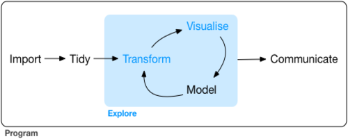

O tidyverse é uma coleção opinativa de pacotes R utilizados para manipulação, exploração e visualizução de dados. Todos os pacotes compartilham uma filosofia de design comum, desenvolvidos principalmente pelo Hadley Wickham, mas agora estão sendo expandidos por vários colaboradores.



### Pacotes
      

            
            
```{r}
if(!require(tidyverse)){install.packages("tidyverse");require(tidyverse)}

tidyverse_packages()
```   

# Readr


Dados de desmatamento na Amazônia por estado nos anos de 2012 a 2015.

```{r, warning=FALSE}

dados <- read_csv2("dados/desmatamento_amazonia_estados_prodes_2012-2015.csv", n_max = 10)
dados

write_csv2(x = dados, path = "dados/desmatamento_amazonia_estados_prodes_2012-2015_v2.csv")

```

### Leitura

read_csv() - Arquivos separados por vírgula <br />
read_tsv() - Arquivos separados por tabulação <br />
read_delim() - Arquivos delimitados gerais <br />
read_fwf() - Arquivos de largura fixa <br />
read_table() - Arquivos tabulares em que as colunas são separadas por espaço em branco. <br />
read_log() - Arquivos de log da web <br />

### Exportação

write_csv() <br />
write_csv2() <br />
write_delim() <br />
write_excel_csv() - Salva de csv para Excel <br />
write_excel_csv2() <br />
write_tsv() <br />


### Outros arquivos

. **haven** Lê arquivos SPSS, Stata , and SAS files. <br />
. **readxl** Lê arquivos excel xls e.xlsx). <br />
. **DBI** , em conjunto junto com um back-end específico do banco de dados (por exemplo,
RMySQL , RSQLite , RPostgreSQL etc.) permite executar consultas SQL em um banco <br />
de dados e retornar uma tabela de dados. <br />
. **Googledrive** importa arquivos do Google Drive <br />
. **jsonlite** Lê  arquivos json <br />
. **xml2** Lê arquivos XML <br />
. **httr** Lê arquivos Web APIs <br />
. **rvest** Lê arquivos HTML

# Tibble


```{r, message=FALSE, warning=FALSE}

head(data.frame(iris))

as_tibble(iris)

```

# Forcats


As principais funções do forcats servem para alterar a ordem e modificar os níveis de um fator. 

```{r}

fator <- factor(c("a","a","a","b","b", "c", "d", "e"))

fct_collapse(fator, b2 = c("b", "c"), a2 = c("a", "d"))

```

```{r}

fct_recode(fator, b2 = "b", b2 = "c", a2 = "a", a2 = "d")

```

```{r}
# Transforma os níveis menos frequentes de um fator em um nível “Outros”.

fct_lump(fator, 2, other_level = "Outros")

```

# Broom


```{r, message=FALSE, warning=FALSE}

if(!require(broom)){install.packages("broom");require(broom)}

fit <- lm(Sepal.Width ~ Petal.Length + Petal.Width, iris)

tidy(fit)

```

**tidy** produz um tibble onde cada linha contém informações sobre um componente importante do modelo. Para modelos de regressão, isso geralmente corresponde a coeficientes de regressão. Isso pode ser útil se você deseja inspecionar um modelo ou criar visualizações personalizadas.


```{r}

glance(fit)

```

**glance** devolve um tibble com exatamente uma linha de qualidade de medidas de condicionamento físico e estatísticas relacionadas. Isso é útil para verificar a especificação incorreta do modelo e comparar muitos modelos.


```{r}

augment(fit, data = iris)

```

**augment** adiciona colunas a um conjunto de dados, contendo informações como valores ajustados, resíduos ou atribuições de cluster. Todas as colunas adicionadas a um conjunto de dados têm .prefixo para impedir que as colunas existentes sejam substituídas.

# Purrr


```{r}
name <- c("Jon Snow", "Asha Greyjoy", "Daenerys Targaryen", "Eddard Stark", "Brienne of Tarth","Melisandre",
         "Kevan Lannister", "Davos Seaworth", "Victarion Greyjoy","Sansa Stark")

# Usando imap_chr o nome (.x) e o índice do nome (.y)

imap_chr(name, ~ paste0(.y, ": ", .x))

imap_chr(name, ~ paste0("Got : ", .x))

```

### Outras Funções

map(.x, .f, ...) <br />

map_if(.x, .p, .f, ...) <br />

map_at(.x, .at, .f, ...) <br />

map_lgl(.x, .f, ...) <br />

map_chr(.x, .f, ...) <br />

map_int(.x, .f, ...) <br />

map_dbl(.x, .f, ...) <br />

map_dfr(.x, .f, ..., .id = NULL) <br />

map_dfc(.x, .f, ...) <br />

walk(.x, .f, ...) <br />


