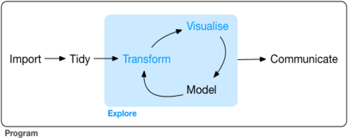
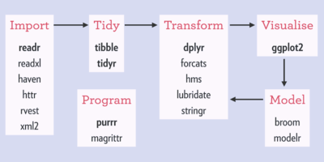

Tidyverse
================
Joziani Mota Vieira

O tidyverse é uma coleção opinativa de pacotes R utilizados para
manipulação, exploração e visualizução de dados. Todos os pacotes
compartilham uma filosofia de design comum, desenvolvidos principalmente
pelo Hadley Wickham, mas agora estão sendo expandidos por vários
colaboradores.



### Pacotes



``` r
if(!require(tidyverse)){install.packages("tidyverse");require(tidyverse)}
```

    ## Loading required package: tidyverse

    ## -- Attaching packages ------------------------------------------------------------------------- tidyverse 1.2.1 --

    ## v ggplot2 3.3.1     v purrr   0.3.2
    ## v tibble  2.1.3     v dplyr   0.8.3
    ## v tidyr   1.0.0     v stringr 1.4.0
    ## v readr   1.3.1     v forcats 0.4.0

    ## -- Conflicts ---------------------------------------------------------------------------- tidyverse_conflicts() --
    ## x dplyr::filter() masks stats::filter()
    ## x dplyr::lag()    masks stats::lag()

``` r
tidyverse_packages()
```

    ##  [1] "broom"       "cli"         "crayon"      "dplyr"       "dbplyr"     
    ##  [6] "forcats"     "ggplot2"     "haven"       "hms"         "httr"       
    ## [11] "jsonlite"    "lubridate"   "magrittr"    "modelr"      "purrr"      
    ## [16] "readr"       "readxl\n(>=" "reprex"      "rlang"       "rstudioapi" 
    ## [21] "rvest"       "stringr"     "tibble"      "tidyr"       "xml2"       
    ## [26] "tidyverse"

# Readr


Dados de desmatamento na Amazônia por estado nos anos de 2012 a 2015.

``` r
dados <- read_csv2("dados/desmatamento_amazonia_estados_prodes_2012-2015.csv", n_max = 10)
```

    ## Using ',' as decimal and '.' as grouping mark. Use read_delim() for more control.

    ## Parsed with column specification:
    ## cols(
    ##   Ano = col_character(),
    ##   Bioma = col_character(),
    ##   Categoria = col_character(),
    ##   Estado = col_character(),
    ##   `Número de registros` = col_double(),
    ##   Período = col_character(),
    ##   `Área Desmatada (Ha)` = col_double()
    ## )

``` r
dados
```

    ## # A tibble: 10 x 7
    ##    Ano    Bioma  Categoria Estado `Número de regi~ Período `Área Desmatada~
    ##    <chr>  <chr>  <chr>     <chr>             <dbl> <chr>              <dbl>
    ##  1 Até 2~ Amazô~ Desflore~ Acre                  1 31/12/~         2069693.
    ##  2 Até 2~ Amazô~ Desflore~ Amapá                 1 31/12/~          296397.
    ##  3 Até 2~ Amazô~ Desflore~ Amazo~                1 31/12/~         3504916.
    ##  4 Até 2~ Amazô~ Desflore~ Maran~                1 31/12/~         8005248.
    ##  5 Até 2~ Amazô~ Desflore~ Mato ~                1 31/12/~        18127035.
    ##  6 Até 2~ Amazô~ Desflore~ Pará                  1 31/12/~        25387874.
    ##  7 Até 2~ Amazô~ Desflore~ Rondô~                1 31/12/~         8602887.
    ##  8 Até 2~ Amazô~ Desflore~ Rorai~                1 31/12/~          976429.
    ##  9 Até 2~ Amazô~ Desflore~ Tocan~                1 31/12/~         2518520.
    ## 10 2013   Amazô~ Desflore~ Acre                  1 31/12/~           19961.

``` r
write_csv2(x = dados, path = "dados/desmatamento_amazonia_estados_prodes_2012-2015_v2.csv")
```

### Leitura

read\_csv() - Arquivos separados por vírgula <br /> read\_tsv() -
Arquivos separados por tabulação <br /> read\_delim() - Arquivos
delimitados gerais <br /> read\_fwf() - Arquivos de largura fixa <br />
read\_table() - Arquivos tabulares em que as colunas são separadas por
espaço em branco. <br /> read\_log() - Arquivos de log da web <br />

### Exportação

write\_csv() <br /> write\_csv2() <br /> write\_delim() <br />
write\_excel\_csv() - Salva de csv para Excel <br />
write\_excel\_csv2() <br /> write\_tsv() <br />

### Outros arquivos

. **haven** Lê arquivos SPSS, Stata , and SAS files. <br /> . **readxl**
Lê arquivos excel xls e.xlsx). <br /> . **DBI** , em conjunto junto com
um back-end específico do banco de dados (por exemplo, RMySQL , RSQLite
, RPostgreSQL etc.) permite executar consultas SQL em um banco <br /> de
dados e retornar uma tabela de dados. <br /> . **Googledrive** importa
arquivos do Google Drive <br /> . **jsonlite** Lê arquivos json <br /> .
**xml2** Lê arquivos XML <br /> . **httr** Lê arquivos Web APIs <br /> .
**rvest** Lê arquivos HTML

# Tibble


``` r
head(data.frame(iris))
```

    ##   Sepal.Length Sepal.Width Petal.Length Petal.Width Species
    ## 1          5.1         3.5          1.4         0.2  setosa
    ## 2          4.9         3.0          1.4         0.2  setosa
    ## 3          4.7         3.2          1.3         0.2  setosa
    ## 4          4.6         3.1          1.5         0.2  setosa
    ## 5          5.0         3.6          1.4         0.2  setosa
    ## 6          5.4         3.9          1.7         0.4  setosa

``` r
as_tibble(iris)
```

    ## # A tibble: 150 x 5
    ##    Sepal.Length Sepal.Width Petal.Length Petal.Width Species
    ##           <dbl>       <dbl>        <dbl>       <dbl> <fct>  
    ##  1          5.1         3.5          1.4         0.2 setosa 
    ##  2          4.9         3            1.4         0.2 setosa 
    ##  3          4.7         3.2          1.3         0.2 setosa 
    ##  4          4.6         3.1          1.5         0.2 setosa 
    ##  5          5           3.6          1.4         0.2 setosa 
    ##  6          5.4         3.9          1.7         0.4 setosa 
    ##  7          4.6         3.4          1.4         0.3 setosa 
    ##  8          5           3.4          1.5         0.2 setosa 
    ##  9          4.4         2.9          1.4         0.2 setosa 
    ## 10          4.9         3.1          1.5         0.1 setosa 
    ## # ... with 140 more rows

# Forcats


As principais funções do forcats servem para alterar a ordem e modificar
os níveis de um fator.

``` r
fator <- factor(c("a","a","a","b","b", "c", "d", "e"))

fct_collapse(fator, b2 = c("b", "c"), a2 = c("a", "d"))
```

    ## [1] a2 a2 a2 b2 b2 b2 a2 e 
    ## Levels: a2 b2 e

``` r
fct_recode(fator, b2 = "b", b2 = "c", a2 = "a", a2 = "d")
```

    ## [1] a2 a2 a2 b2 b2 b2 a2 e 
    ## Levels: a2 b2 e

``` r
# Transforma os níveis menos frequentes de um fator em um nível “Outros”.

fct_lump(fator, 2, other_level = "Outros")
```

    ## [1] a      a      a      b      b      Outros Outros Outros
    ## Levels: a b Outros

# Broom


``` r
if(!require(broom)){install.packages("broom");require(broom)}

fit <- lm(Sepal.Width ~ Petal.Length + Petal.Width, iris)

tidy(fit)
```

    ## # A tibble: 3 x 5
    ##   term         estimate std.error statistic  p.value
    ##   <chr>           <dbl>     <dbl>     <dbl>    <dbl>
    ## 1 (Intercept)     3.59     0.0937     38.3  2.51e-78
    ## 2 Petal.Length   -0.257    0.0669     -3.84 1.80e- 4
    ## 3 Petal.Width     0.364    0.155       2.35 2.01e- 2

**tidy** produz um tibble onde cada linha contém informações sobre um
componente importante do modelo. Para modelos de regressão, isso
geralmente corresponde a coeficientes de regressão. Isso pode ser útil
se você deseja inspecionar um modelo ou criar visualizações
personalizadas.

``` r
glance(fit)
```

    ## # A tibble: 1 x 11
    ##   r.squared adj.r.squared sigma statistic p.value    df logLik   AIC   BIC
    ##       <dbl>         <dbl> <dbl>     <dbl>   <dbl> <int>  <dbl> <dbl> <dbl>
    ## 1     0.213         0.202 0.389      19.9 2.24e-8     3  -69.8  148.  160.
    ## # ... with 2 more variables: deviance <dbl>, df.residual <int>

**glance** devolve um tibble com exatamente uma linha de qualidade de
medidas de condicionamento físico e estatísticas relacionadas. Isso é
útil para verificar a especificação incorreta do modelo e comparar
muitos modelos.

``` r
augment(fit, data = iris)
```

    ## # A tibble: 150 x 12
    ##    Sepal.Length Sepal.Width Petal.Length Petal.Width Species .fitted
    ##           <dbl>       <dbl>        <dbl>       <dbl> <fct>     <dbl>
    ##  1          5.1         3.5          1.4         0.2 setosa     3.30
    ##  2          4.9         3            1.4         0.2 setosa     3.30
    ##  3          4.7         3.2          1.3         0.2 setosa     3.33
    ##  4          4.6         3.1          1.5         0.2 setosa     3.27
    ##  5          5           3.6          1.4         0.2 setosa     3.30
    ##  6          5.4         3.9          1.7         0.4 setosa     3.30
    ##  7          4.6         3.4          1.4         0.3 setosa     3.34
    ##  8          5           3.4          1.5         0.2 setosa     3.27
    ##  9          4.4         2.9          1.4         0.2 setosa     3.30
    ## 10          4.9         3.1          1.5         0.1 setosa     3.24
    ## # ... with 140 more rows, and 6 more variables: .se.fit <dbl>,
    ## #   .resid <dbl>, .hat <dbl>, .sigma <dbl>, .cooksd <dbl>,
    ## #   .std.resid <dbl>

**augment** adiciona colunas a um conjunto de dados, contendo
informações como valores ajustados, resíduos ou atribuições de
cluster. Todas as colunas adicionadas a um conjunto de dados têm
.prefixo para impedir que as colunas existentes sejam
substituídas.

# Purrr


``` r
name <- c("Jon Snow", "Asha Greyjoy", "Daenerys Targaryen", "Eddard Stark", "Brienne of Tarth","Melisandre",
         "Kevan Lannister", "Davos Seaworth", "Victarion Greyjoy","Sansa Stark")

# Usando imap_chr o nome (.x) e o índice do nome (.y)

imap_chr(name, ~ paste0(.y, ": ", .x))
```

    ##  [1] "1: Jon Snow"           "2: Asha Greyjoy"      
    ##  [3] "3: Daenerys Targaryen" "4: Eddard Stark"      
    ##  [5] "5: Brienne of Tarth"   "6: Melisandre"        
    ##  [7] "7: Kevan Lannister"    "8: Davos Seaworth"    
    ##  [9] "9: Victarion Greyjoy"  "10: Sansa Stark"

``` r
imap_chr(name, ~ paste0("Got : ", .x))
```

    ##  [1] "Got : Jon Snow"           "Got : Asha Greyjoy"      
    ##  [3] "Got : Daenerys Targaryen" "Got : Eddard Stark"      
    ##  [5] "Got : Brienne of Tarth"   "Got : Melisandre"        
    ##  [7] "Got : Kevan Lannister"    "Got : Davos Seaworth"    
    ##  [9] "Got : Victarion Greyjoy"  "Got : Sansa Stark"

### Outras Funções

map(.x, .f, …) <br />

map\_if(.x, .p, .f, …) <br />

map\_at(.x, .at, .f, …) <br />

map\_lgl(.x, .f, …) <br />

map\_chr(.x, .f, …) <br />

map\_int(.x, .f, …) <br />

map\_dbl(.x, .f, …) <br />

map\_dfr(.x, .f, …, .id = NULL) <br />

map\_dfc(.x, .f, …) <br />

walk(.x, .f, …) <br />
